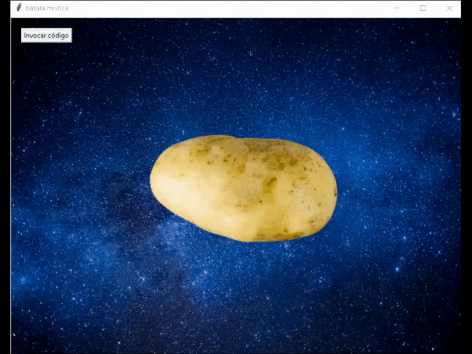

<h1 align="center">Batata Mística </h1>

<p align="center">
  
</p>

<p align="center">
  <a href="https://www.python.org/">
    
  </a>
  <a href="https://aiohttp.readthedocs.io/">
    
  </a>
  <a href="https://pypi.org/project/python-dotenv/">
    
  </a>
  <a href="https://pypi.org/project/Pillow/">
    
  </a>
  <a href="https://pypi.org/project/pyttsx3/">
    
  </a>
</p>

> 🌟 Um projeto divertido com toque místico e IA generativa para comentar seu código em forma poética.

## 📃 Descrição

A Batata Mística Flutuante é uma aplicação que analisa seu código Python e faz comentários de forma esotérica, mística e cheia de personalidade. Ela usa um modelo de linguagem via API da [chutes.ai](https://chutes.ai/) com o modelo **DeepSeek**, somado a uma interface gráfica simples.

> ⚡ O projeto foi desenvolvido com foco em aplicações interativas com IA, interfaces gráficas e comunicação leve com APIs.

## 🧰 Tecnologias Utilizadas

* **Python 3.10+**
* **python-dotenv** – Gerenciamento de variáveis de ambiente
* **aiohttp** – Cliente HTTP assíncrono
* **pyttsx3** – Conversão de texto em fala (TTS offline)
* **Pillow** – Manipulação de imagens
* **API chutes.ai** – Integração com modelo LLM
* **Tkinter** – Interface gráfica (frontend.py)

## ⚖️ Como Usar

### 1. Clone o repositório

```bash
git clone https://github.com/seuusuario/BatataMistica.git
cd BatataMistica
```

### 2. Instale as dependências

```bash
pip install -r requirements.txt
```

### 3. Configure a API Key

Crie um arquivo `.env` na raiz do projeto e adicione sua chave da chutes.ai:

```env
API_KEY="SUA_CHAVE_AQUI"
```

### 4. Execute a aplicação

```bash
python frontend.py
```

Um botão aparecerá no canto superior esquerdo. Clique nele, cole seu código Python e confirme.
A batata pensará profundamente, depois comentará seu código com palavras mágicas (pode levar alguns segundos).

## 👨‍💼 Desenvolvedores

* [Louise Morais](https://github.com/louisemorais)
* [Gabriel Detoffel](https://github.com/GabrielDetoffel)

## 📚 Licença

Este projeto está licenciado sob a licença [MIT](https://choosealicense.com/licenses/mit/)

---

<p align="center">
  Feito com ✨ e criatividade por Louise e Gabriel
</p>
